# 🎯 PlanMatik — Plan Better, Live Better

[](https://react.dev/)
[](https://www.typescriptlang.org/)
[](https://tailwindcss.com/)
[](https://github.com/)

> **PlanMatik**, modern yaşamın hızında görevlerinizi, hedeflerinizi, geri sayımlarınızı ve zengin notlarınızı tek bir estetik merkezde buluşturan üst düzey mobil odaklı bir üretkenlik & organizasyon platformudur.

---

## 📱 Uygulama Arayüzü & Ekran Görüntüleri (16 Modül)

Aşağıda **PlanMatik** uygulamasının tüm temel işlevlerine ait yüksek çözünürlüklü arayüz ekran görüntüleri ve sıralı detaylı kullanım açıklamaları yer almaktadır:

### 1. 🔐 Giriş, Karşılama & Hesap Güvenliği

| 01. Karşılama & Veri Saklama Tercihi | 02. PIN Kodu ile Güvenlik Doğrulaması |
| :---: | :---: |
| 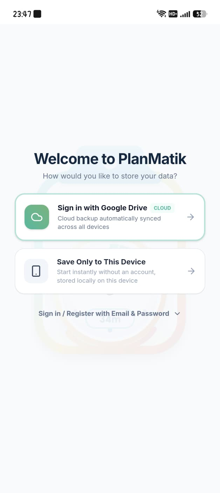 | 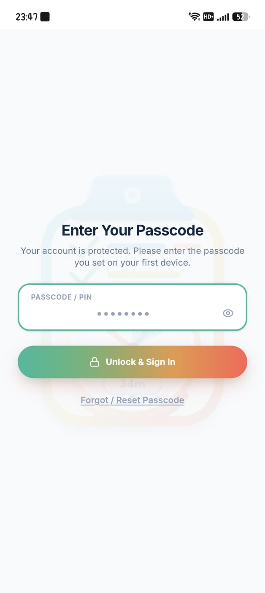 |
| **Kullanıcı Karşılama & Hibrit Depolama:** İlk açılışta kullanıcıyı karşılayan karşılama ekranı. Google Drive ile tüm cihazlar arasında bulut senkronizasyonu, hesap açmadan doğrudan cihazda yerel (offline) saklama veya E-posta & Şifre ile kayıt/giriş seçenekleri sunar. | **Kişisel Veri & Hesap Koruma Kilidi:** Kullanıcı verilerini yetkisiz erişimlere karşı korumak için tasarlanmış parola/PIN ekranı. İlk kurulumda belirlenen 8 haneli güvenlik kodunun girilmesini talep ederek not ve planların gizliliğini sağlar. |

---

### 2. ⚡ Doğrulama & Hızlı Eylem Menüsü

| 03. PIN Girişi & Doğrulama Durumu | 04. Hızlı Eylem Menüsü (Quick Actions) |
| :---: | :---: |
| 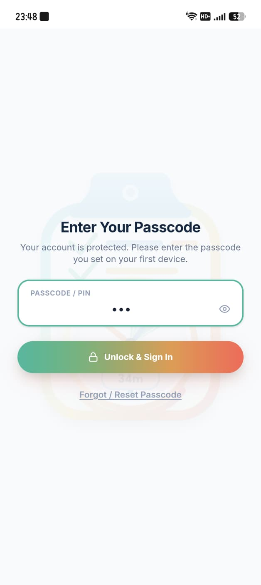 | 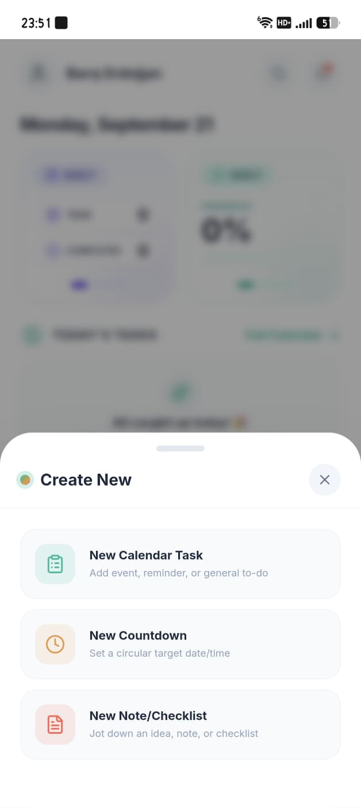 |
| **Canlı Parola Girişi ve Kilit Açma:** Kullanıcının PIN kodunu tuşladığı anı gösteren dinamik durum; maskelenmiş PIN kutucuğu, tek dokunuşla "Unlock & Sign In" eylemi ve parola sıfırlama seçeneği. | **Merkezi Hızlı Eylemler (Bottom Sheet):** Alt gezinti çubuğundaki (+) butonuna dokunulduğunda açılan akıllı menü; "New Calendar Task", "New Countdown" ve "New Note/Checklist" oluşturma kısayollarını sunar. |

---

### 3. 🎯 Görev & Geri Sayım Planlayıcı Modalları

| 05. Yeni Takvim Görevi Oluşturma | 06. Yeni Geri Sayım & Kritik Uyarı Eşiği |
| :---: | :---: |
| 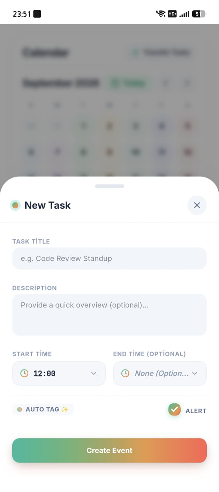 | 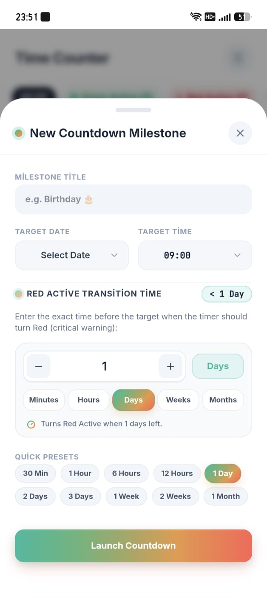 |
| **Detaylı Görev & Etkinlik Planlama:** Görev başlığı, opsiyonel açıklama, hassas zaman seçici (TimeDropdown), otomatik etiketleme (Auto Tag ✨) ve zamanlanmış bildirim uyarısı (Alert) içeren etkinlik oluşturucu. | **Milat Sayacı & Kırmızı Eşik Belirleme:** Hedef tarih/saat kurulumu, dairesel sayaç başlatma, sayacın kırmızıya döneceği kritik eşik zamanı (dakika, saat, gün, hafta, ay) ve hazır şablon süreler (Quick Presets). |

---

### 4. 📝 Zengin Not & İnteraktif Kontrol Listesi (Checklist) Editörleri

| 07. Çok Sayfalı Not Editörü | 08. İnteraktif Checklist Oluşturucu |
| :---: | :---: |
| 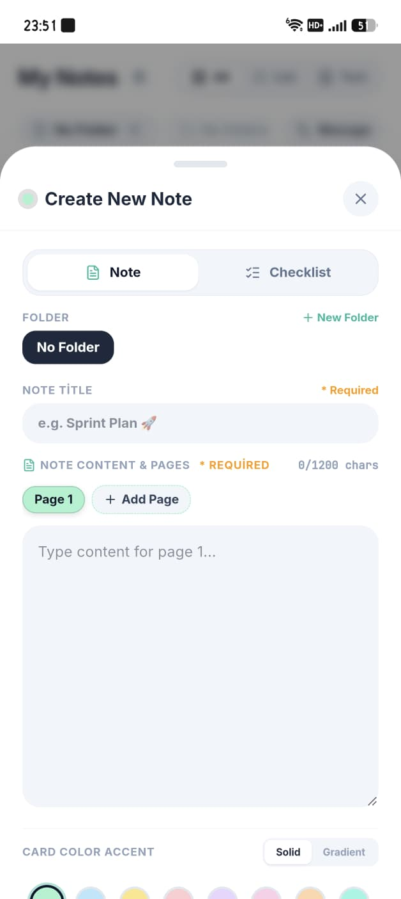 | 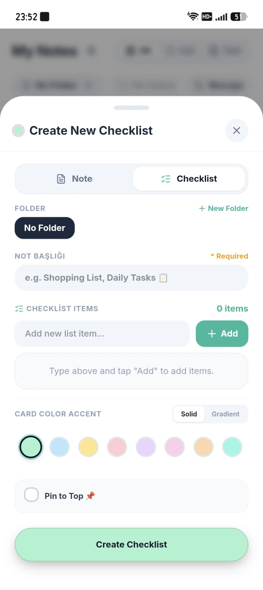 |
| **Çok Sayfalı Not Mimarisi:** Klasörleme, başlık, çok sayfalı mimari (+ Add Page / Sayfa 1), karakter sayacı (0/1200) ve canlı pastel/gradyan kart renk paleti (Card Color Accent) ile zengin not oluşturma deneyimi. | **Dinamik Kontrol Listesi & Başa Sabitleme:** Yeni yapılacaklar maddeleri ekleme (+ Add), başa sabitleme (Pin to Top 📌), klasör seçimi ve kart rengi uyumlu şeritler ile dinamik checklist hazırlama. |

---

### 5. 📅 Akıllı Takvim & Görev Erteleme (Rollover)

| 09. Aylık Takvim & Günlük Görev Akışı | 10. Tamamlanmayan Görevleri Aktarma |
| :---: | :---: |
| 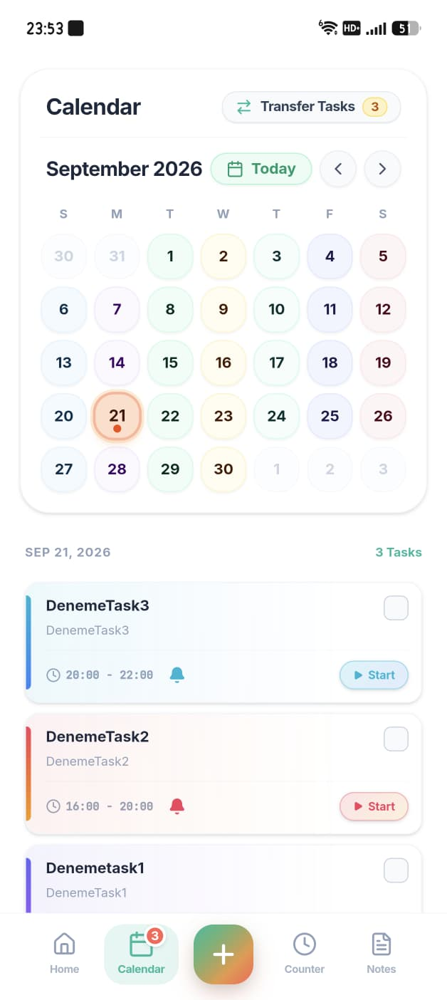 | 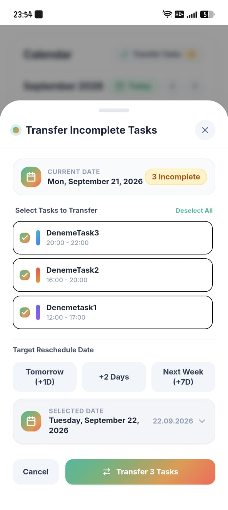 |
| **İnteraktif Takvim & Görev Zaman Çizelgesi:** Aylık görünüm, gün noktaları, seçilen günün 24 saatlik görev kartları, süre aralıkları, sesli bildirim uyarısı ve tek dokunuşla görev başlatma (Start) kontrolleri. | **Görev Devri & Yeniden Planlama (Rollover):** Günün tamamlanmayan işlerini seçerek ertesi güne (Tomorrow +1D), 2 gün sonraya (+2 Days) veya gelecek haftaya (+7D) zahmetsizce aktarma ve taşıma paneli. |

---

### 6. ⏳ Canlı Sayaç Merkezi & Uyarı Bölgeleri

| 11. Canlı Dairesel Sayaç (Güvenli Bölge) | 12. Kritik Eşik Alarmı & Süresi Dolan Sayaçlar |
| :---: | :---: |
| 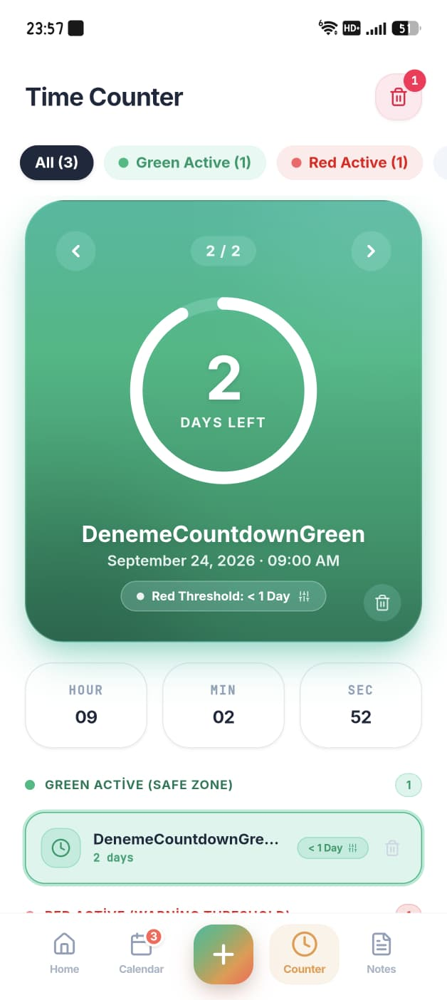 | 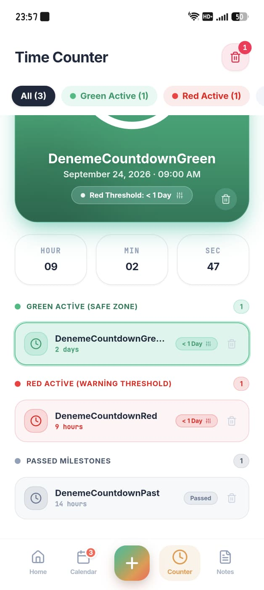 |
| **Dairesel İlerleme Halkası & Canlı Kronometre:** Kalan gün sayısını gösteren dairesel sayaç kartı, saniye hassasiyetinde canlı akan saat/dakika/saniye göstergesi ve Yeşil Güvenli Bölge (Green Active) listesi. | **Kritik Kırmızı Alarm & Milat Arşivi:** Kritik eşik süresi dolmak üzere olan sayaçların kırmızı alarm uyarısı (Red Active), güvenli sayaçlar ve vadesi geçmiş tamamlanmış sayaçlar (Passed Milestones). |

---

### 7. 🗂️ Not Kataloğu & Kullanıcı Profili

| 13. Zengin Not Kataloğu & İlerleme Takibi | 14. Profil, İstatistikler & Tercihler |
| :---: | :---: |
| 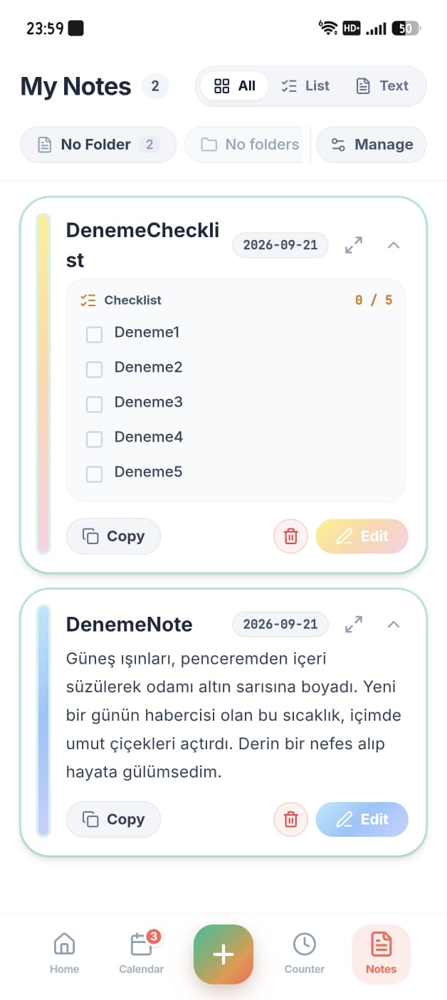 | 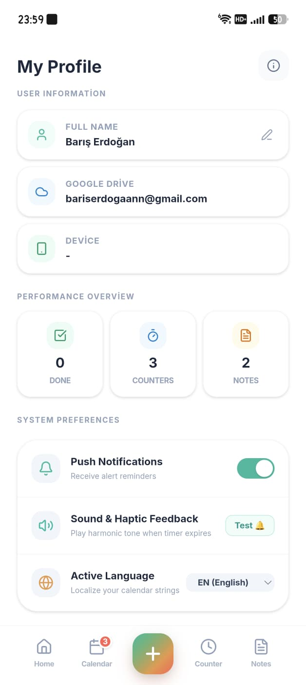 |
| **Görsel Not Kartları & Tamamlanma Oranları:** Checklist maddeleri ve uzun metin notlarının yer aldığı akış; liste filtreleri, 0/5 tamamlanma sayacı, tek dokunuşla kopyalama, silme ve düzenleme aksiyonları. | **Kullanıcı Bilgileri & Performans Özeti:** Kullanıcı kimliği (Barış Erdoğan, Drive e-postası), tamamlanan görev/sayaç/not sayıları, anlık bildirim ayarı, sesli/haptik geri bildirim testi ve dil seçimi. |

---

### 8. ☁️ Bulut Senkronizasyonu & Güvenli Veri Yönetimi

| 15. Google Drive Gerçek Zamanlı Bulut Senkronizasyonu | 16. Veri Yedekleme, Sıfırlama & Hesap Güvenliği |
| :---: | :---: |
| 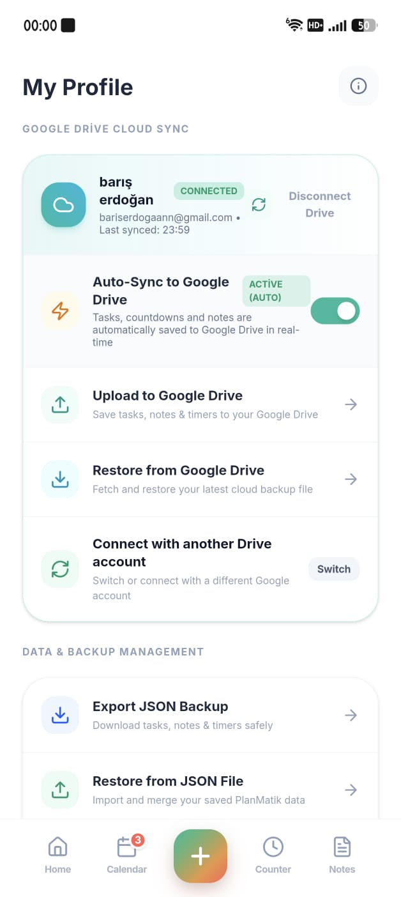 | 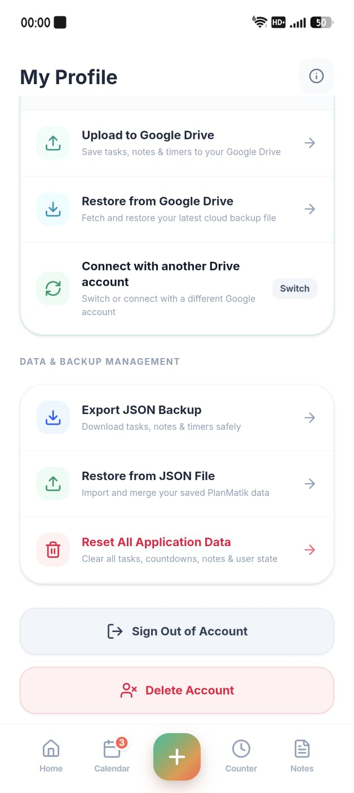 |
| **Gerçek Zamanlı Drive Eşitleme (Auto-Sync):** Google Drive bağlantı durumu, son senkronizasyon zamanı, otomatik arka plan eşitlemesi anahtarı, manuel Drive'a yükleme / Drive'dan indirme ve hesap değiştirme. | **JSON Dışa/İçe Aktarma & Hesap Yönetimi:** Tüm görev ve notları JSON dosyası olarak cihazınıza güvenle indirme veya geri yükleme, tüm uygulama verilerini sıfırlama, oturumu kapatma ve hesabı silme alanı. |

---

## ✨ Öne Çıkan Temel Özellikler

### 1. 📅 Dinamik Akıllı Takvim & Görev Yönetimi
- **Zaman Çizelgesi & Ajanda Görünümü:** Günlük, haftalık ve aylık görev dağılımları.
- **Kategorilendirme & Önceliklendirme:** Renk kodlu görevler, aciliyet etiketleri ve tamamlanma filtreleri.
- **Akıllı Hatırlatıcılar & Döngüler:** Tekrarlayan rutinler ve zaman kilitli aktiviteler.

### 2. 📝 Zengin Notlar & Çok Sayfalı Kontrol Listeleri (Checklist)
- **Akıllı Sayfalama:** Tek bir not kartı içinde birden çok sayfa (Pages) oluşturabilme.
- **Kişiselleştirilebilir Canlı Renk Paleti:** Kullanıcının seçtiği pastel ve gradyan renklerle senkronize sol şerit, ilerleme (dolum) çubuğu ve rozetler.
- **Gölgesiz & Sade Düz Tasarım:** Minimalist hap butonlar (Kopyala, Sil, Düzenle) ile modern ve temiz görünüm.
- **Tam Ekran Okuma Modu:** Kesintisiz, odaklı okuma ve düzenleme ortamı.

### 3. ⏳ Hassas Geri Sayım (Countdown) Sayacı
- **Milat & Hedef Takibi:** Sınavlar, projeler, doğum günleri, tatiller veya kritik teslim tarihleri için dinamik zaman sayaçları.
- **Canlı Zaman Kartları:** Gün, saat, dakika ve saniye bazında görsel akıcı animasyonlar.

### 4. 🎨 Üstün Tasarım & Kullanıcı Deneyimi (UX/UI)
- **Karanlık (Dark) & Aydınlık (Light) Mod:** Kusursuz kontrast oranlarına (WCAG AA) sahip göz yormayan arayüz.
- **Mikro Etkileşimler:** `motion` motoru ile desteklenen dokunsal hisli butonlar ve yumuşak sayfa geçişleri.
- **Çoklu Dil Desteği:** Türkçe ve İngilizce tam yerelleştirme altyapısı.
- **Çevrimdışı & Yerel Öncelikli Güvenlik:** Firebase bulut senkronizasyonu ve LocalStorage yedekliliği.

---

## 🛠️ Teknoloji Yığını (Tech Stack)

| Katman | Teknoloji | Açıklama |
| :--- | :--- | :--- |
| **Frontend Framework** | **React 19** | Modern declarative UI mimarisi |
| **Dil** | **TypeScript 5.8** | Tam tip güvenliği (Type-Safe) ve sıfır çalışma zamanı hatası |
| **Stil & CSS** | **Tailwind CSS v4** | Yeni nesil derleyici ile ultra hızlı stil altyapısı |
| **Animasyon Motoru** | **Motion (`motion/react`)** | Akıcı, donanımdan hızlandırılmış geçişler ve hareketler |
| **İkonografi** | **Lucide React** | Modern, minimalist ve optimize vektörel ikonlar |
| **Bulut & Senkronizasyon** | **Firebase Firestore & Auth** | Gerçek zamanlı veri tabanı ve yedekleme |
| **Derleme & Paketleme** | **Vite 6** | Yıldırım hızında HMR ve optimize üretim derlemesi |

---

## 🚀 Projeyi Yerel Ortamda Çalıştırma

Projeyi kendi bilgisayarınızda çalıştırmak için aşağıdaki adımları izleyin:

### Gereksinimler
- Node.js (v18 veya üzeri önerilir)
- npm veya yarn / bun

### Kurulum Adımları
```bash
# 1. Projeyi klonlayın (veya dosyaları indirin)
git clone https://github.com/KULLANICI_ADINIZ/planmatik.git

# 2. Proje dizinine geçin
cd planmatik

# 3. Bağımlılıkları yükleyin
npm install

# 4. Geliştirme sunucusunu başlatın
npm run dev
```
Uygulama varsayılan olarak `http://localhost:3000` adresinde çalışacaktır.

### Üretim (Production) Derlemesi
```bash
npm run build
npm run preview
```

---

## 📁 Proje Dizin Yapısı

```
├── docs/
│   └── screenshots/       # README portföy ekran görüntüleri (01'den 16'ya kadar tüm modül arayüz görselleri)
├── src/
│   ├── components/        # Modüler UI bileşenleri (HomeScreen, NotesScreen, CalendarScreen vb.)
│   ├── context/           # Dil (Language) ve Tema Context sağlayıcıları
│   ├── utils/             # Zaman, renk ve formatlama yardımcı fonksiyonları
│   ├── types.ts           # Global veri modelleri ve TypeScript arayüzleri
│   ├── App.tsx            # Ana uygulama kontrolörü ve ekran rotaları
│   └── main.tsx           # React giriş noktası
├── public/                # Statik varlıklar, PWA manifesti ve ikonlar
├── metadata.json          # Uygulama meta verileri
└── package.json           # Proje paket ve betik tanımları
```

---

## 🔒 Lisans & Gizlilik
Bu proje **Özel (Private Repository)** olarak geliştirilmiştir. Tüm hakları saklıdır. İzin alınmaksızın kopyalanamaz veya ticari amaçla dağıtılamaz.
